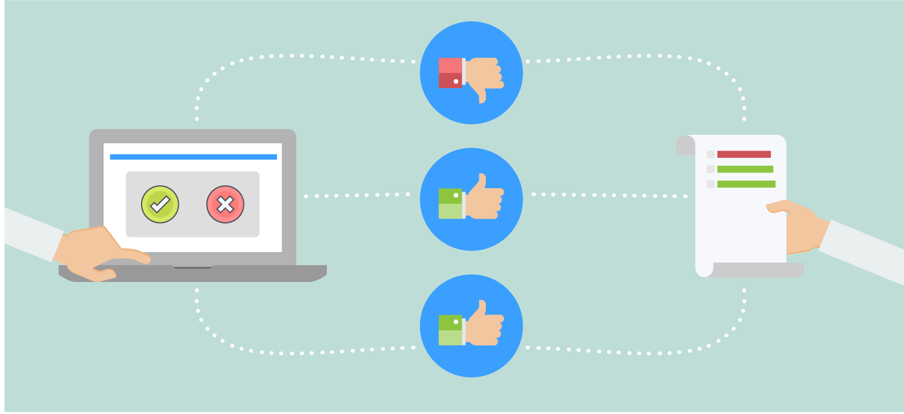

# Parental Consent

A common scenario involves an application where users need to sign documents within the application as part of a process. For example, a partner portal for onboarding new partners that requires them to sign an NDA or an e-commerce application that requires users to sign a purchase agreement. In these cases, the document is not sent to recipients for signature, but is presented to them within your application.

For this type of integration, Adobe Sign supports creating a Widget through the Adobe Sign APIs. A widget is like a reusable template that can be presented to users multiple times and signed multiple times. Each time a widget gets signed, the signed document becomes a separate instance of the document. A good way to think about the relationship of the widget and the documents signed through it is a parent-child relationship. A widget can be presented either to an anonymous signer, in which case Adobe Sign can validate the signer&rsquo;s identity as part of the signing process, or to a signer whose identity can be specified through the API by the hosting application.

Now, consider a scenario where parents&rsquo; consent is required for young school-going kids to do some light work as part of their school trip. In this case, the school is required to get the parent&rsquo;s consent by asking them to sign a form. Once the form has been completed and signed by the child&rsquo;s parent, the school can engage the kid with the planned activities.

The entire consent workflow can be achieved through the Sign APIs.

The school does the following:

1. Creates a Sign Widget with the required details and form elements.
2. The Widget URL is circulated to all the parents.
3. Whenever a parent signs the widget, a signed agreement can be downloaded by the school.

You can create a signable web form (Widget) by uploading any standard document and adding fields using the drag-and-drop interface provided by Adobe Sign. You can also upload an existing PDF form with its fields, or insert text tags into a document which Adobe Sign will automatically turn into form fields. You can do all of these through the Sign APIs.

Before you begin creating a Widget, learn to [upload a document for signing](../api_uasge/send_signing.md).

## **Creating a Widget**

See [Creating a Widget](../api_uasge/create_widget.md).

Each time a widget is signed by a parent, a separate instance of a document gets created. To get the agreements created using the widget, see [Download the Agreement](../api_uasge/download_agreement.md) .

